# 日立 手書きメモ文字起こし

## 大学で学んでいること・研究・専門分野・技術スタック

- 医療 × 情報工学の融合分野で学んでる。
- 自分が配属予定の研究室では例えば、あるい薬があったときにそれが本当に、治療効果に寄与しているのかっていうのを機械学習など統計的な手法を使って分析するといったようなことを学んでいく形です。
- 長期インターンでデータ収集の経験 + AIエージェント の開発の経験がある

## 志望動機（要見直）

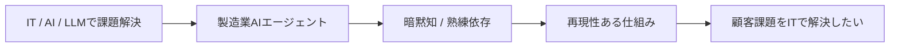

- ITやAI・LLMといった技術で、顧客の課題を解決したい。
- 長期インターンで、製造業向けの業務支援AIエージェントの開発をしたことがある。
- その会社では、職人の腕に頼りきりで、その人の感覚とか暗黙知的な部分に頼ってしまっていた。
- その人がいないと、その会社は成り立たないという現状があった。
- 結構規模の大きな会社でもそういう現状があるのを目の当たりにした。
- そういった課題は、ITやAIの技術があれば、再現性のある技術にすることができると考えた。
- こういった顧客の課題を、ITの力で解決したい。

## なぜ日立か（要見直）

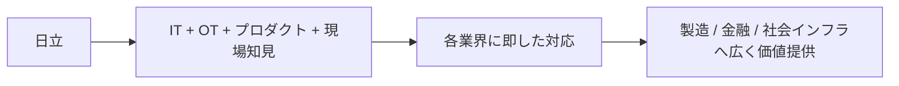

- ITだけでなく、OTやプロダクトの知見があり、現場に対応できる基盤がある。
- その基盤があるから、幅広い分野に対応できる。
- 先ほど申し上げたのは製造業でしたが、製造業以外であっても、ITで効率化・合理化をもたらせるべき業界・業務はたくさんある。
- だから、さまざまな業務に対応できる環境があると考えたため御社を志望。
- （これは、ハードウェアをやりたいのかって言われた時の切り返し）ハードやその会社固有のドメイン知見があるから、ソフトウェアも作りやすい。
- （これも、ハードウェアをやりたいのかって言われた時の切り返し）鉄道の管理アプリのように、ハードそのものを作らなくても、現場知見があることでソフトに強みが出る。

## なぜアプリケーションエンジニアか

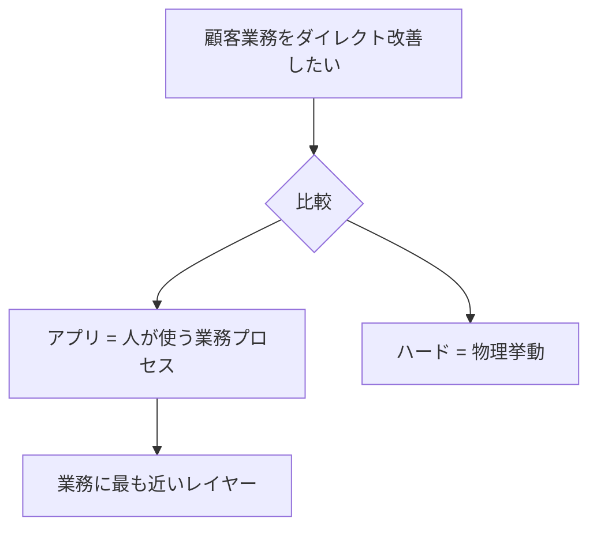

- アプリケーションは、人間や顧客の業務をダイレクトに改善できるところに魅力を感じる。
- ハードウェアだと、物理的な挙動をどうするかというのがメインになる。
- 一方でアプリケーションは、人間の業務プロセスの改善にダイレクトに寄与できると思う。
- そのため、業務に最も近いレイヤーに携わることができるアプリケーションエンジニアにも魅力を持っている。

## 日立で何をしたいか（要見直）

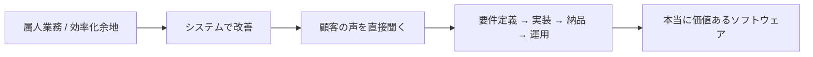

- 先ほど申し上げたような、現場に残る属人性のある仕事や、ITで置き換えることで効率化できる仕事を、システムによって改善したいと考えている。
- 要件定義から実装、納品、運用までの全ての工程を見れるようにしたい。
- っていうのも、自分自身の経験の中で、実装の部分だけを任されるっていうのがソフトウェアエンジニアだから当然だけど、でも実際にアプリを使っている顧客の声がダイレクトに届いてこないため、顧客が必要としていることに対して直接解決することができなかったり、営業や顧客と折衝している人からの又聞きしかできなくて、推測しながらでしか開発できなかった。
- そこで自分はしっかり要件定義や、運用の中でしっかり顧客の要望をヒアリングして、本当に価値のあるソフトウェアというものを届けられるようにしたい。
 

## ガクチカ

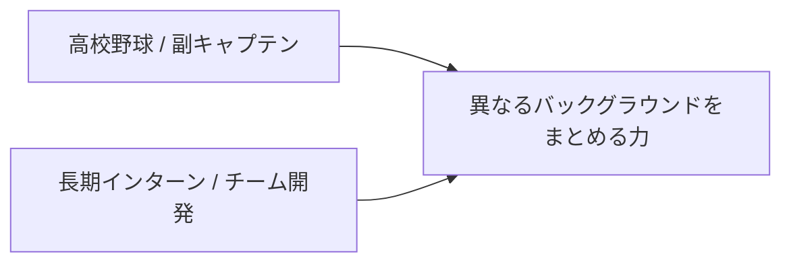

### 1つ目

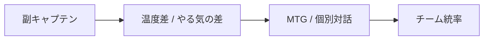

- 高校野球で、副キャプテンとしてチームをまとめたこと。
- [補足メモ・判読難] レベルの高い人や人数の多い環境の中で、まとめ役を担った。
- 夏の大会では、副キャプテンとしてMTGの取りまとめなどをした。  
  （後半は推定）

### 2つ目

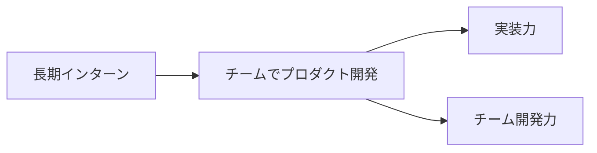

- 長期インターンで、チームでプロダクトを作る力をつけられたこと。  
- システム開発を通じて、社会で使われるレベルのプロダクトの実装力をつけることができた。
- プラスで、チーム開発を通してビジネスの場でのチーム力も身につけられた。
- [具体的にどんな業務をしていたのかっていうのを深ぼられたときに答える] 主に二社あって、今はやってないのですが、そこは主にLLMを使ったアプリ開発をすることで業務のDXを支援する会社でAIエージェントや、RAGっていう技術を活用してチャットボットの開発をしていた。また現在も続けている会社は、企業データを提供するSaaSを開発してる会社で、これは主にBtoB営業などで役立てられているですが、、そういった会社っていうこともあって主に、さまざまな企業のデータを収集、スクレイピング、クローリングっていうのですが、そういった技術でデータ収取するデータエンジニアのようなことをしております。

## チームで取り組んだ経験 ＝ チーム・この取り組みの中でで困難だった点

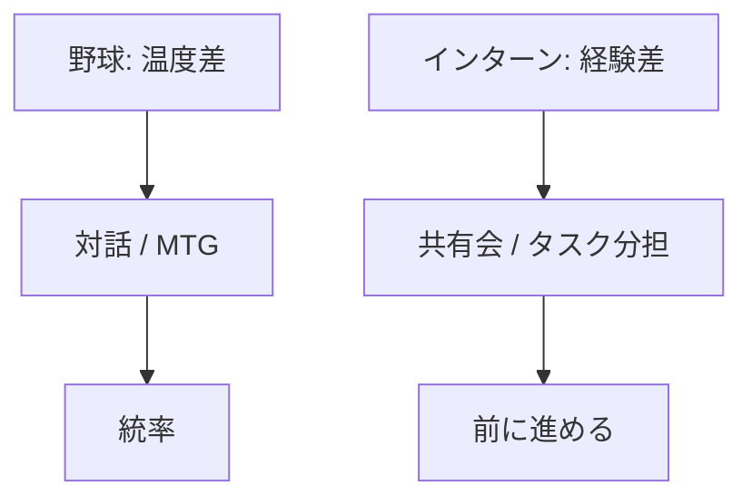

### 野球

- 最後の夏の大会で、副キャプテンの立場からチームを引っ張った。
- 最後の夏の大会で、ベンチに入った人と、ベンチに入らなかった人との間で、やる気の差・乖離が大きかった。
- 自分自身、ベンチに入ったことも外れたこともどっちもあった唯一のメンバーだからどっちの気持ちもわかっていたってこともあって、チームをまとめるために
- MTG開いたり、一人一人ヒアリングしていって、、、対話していって、全体のモチベーションを上げていってチームの統率を作ったという経験がある

### インターン

- チームの中でも経験が長い人もいれば、未経験で大学でCSを学んだことがないメンバーもいた。
- その中で、雑談・ノウハウ共有の会を設けた。対策1
- 適切なタスクの割り当てをした。対策2

## ガクチカから何を学んだか

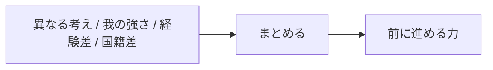

- 異なるバックグラウンドをもつメンバーがいるチームで、前に進んでいく力。
- 高校野球では、異なる考えや、我の強いのメンバーをまとめた。  
- チーム開発では、異なる領域・技術スタックをもつメンバー、人種・海外のメンバーも見た。  
- 高レラから異なるバックグラウンドをもつメンバーをまとめる力を学んだ。

## 他社状況

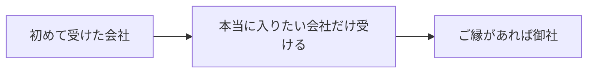

- 今回の選考が自分の就職活動の中で初めて受けた会社。自分自身今のインターンが楽しくてなるべくインターン方に時間をさきたくて、自分が本当に入りたいって思う会社だけ受けようと考えていて、
- 今回の就活の軸で見た中で、もしご縁があれば御社に入らせていただきたいと考えております。

## 強み・弱み

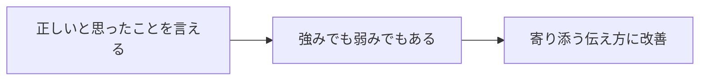

- これは強みでも弱みでもある。
- 正しいと思ったこと、論理的に正しいと思ったことをストレートに伝えられる。
- どうしても部活であったり仕事でも、そういった真剣な場では、指摘しなければならない状況はどうしてもあって、そこで自分は割とストレートに伝えることができると思っています。
- 一方で、実際のコミュニケーションでは、正論を言えばその人が動いてくれるというわけではないと思っています。
- そのため、現在は、例えば、指摘するだけではなくて一緒に寄り添って自分はこう考えるんだけど、あなたはどう思いますかっていう、一緒に寄り添って考えるスタイルにしたりとか、工夫をしてコミュニケーションを取ろうとしている。

## キャリアプラン

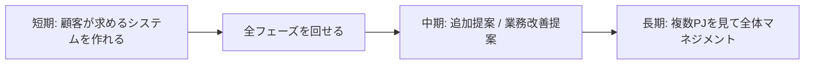

- 短期的な目標で言うと、まずはしっかり顧客が求めるシステムを作れるようになりたい。
- そのために、要件定義から実装、納品、運用の全てのフェーズを回せる人間になりたい。
- そのあとは、こういうシステムも入れたほうがより効率化できますよ、というような、アップセルというか、より顧客の業務を改善できる提案もできるようになりたい。
- そして長期でいうと、自分がプレイヤーとしてだけで動くのではなく、さまざまなプロジェクトを見て全体をマネジメントしていって、より自分の影響範囲を大きくしていきたいと考えている。

## 逆質問
- せっかくこうやって長く開発をやられている方とお話しできる機会なので、ここで聞くのが正しいかはわからないのですが、純粋に聞きたいことがあるのですが、システム開発をしていく中でどうしても納期だとか期限に間に合わないことってあると思うのですが、そこで〇〇さんはどうされているのかっていうのをお聞きしてもよろしいですか。
- 業界を横断して案件に入ることはできるか。さまざまな業界を経験できるか。