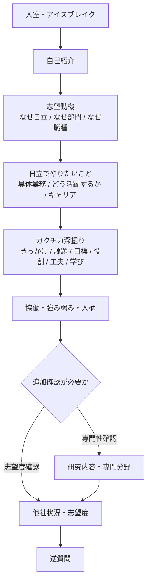

# 日立 最終面接分析

## 前提

- 対象は、公開体験記における `最終面接` `二次マッチング` `二次ジョブマッチング` `マッチング面談二次` `プレミアムセミナー（最終面接）`
- 主に `24卒〜27卒の技術系総合職`
- 今回は `ITデジタルソリューション` 向けに解釈

## 結論

- 形式は `オンライン` `約1時間` `学生1人` `面接官2〜3人` が基本
- 面接官は `人事 + 現場社員 / 志望職種の管理職 / 部門長` が多い
- 一次よりも、`志望の具体性` `職種とのマッチ度` `入社後の活躍イメージ` `ES・一次との一貫性` を見られる
- 感覚としては、`志望動機面接` というより `配属マッチング面接`

## 形式の傾向

| 項目 | 傾向 |
| --- | --- |
| 名称 | 最終面接 / 二次マッチング / 二次ジョブマッチング / マッチング面談二次 / プレミアムセミナー |
| 会場 | ほぼオンライン |
| 時間 | 1時間前後 |
| 学生 | 1人 |
| 面接官 | 2〜3人 |
| 面接官の中身 | 人事 + 志望職種の社員 / マネージャー / 部門長 |
| 雰囲気 | 穏やか寄りだが、深掘りは強い |
| 最後 | 逆質問あり |

## 大体の質問の流れ

### 典型パターン

1. 入室、アイスブレイク、簡単な自己紹介
2. 志望動機
3. なぜ日立か
4. なぜその部門か、なぜその職種か
5. 日立で何をしたいか、どの職種でどう活躍したいか
6. 学生時代に力を入れたこと
7. ガクチカ深掘り
8. チーム経験、強み弱み、人柄
9. 研究内容、専門分野、技術的な関心
10. 他社状況、志望度
11. 逆質問

### 変則パターン

- インターン経由
  最初に `インターンで印象に残ったこと` `学び` `入社後どう活かすか` が入る

- AI・専門性寄り
  `なぜAIがいいか` `AIに興味を持ったきっかけ` `研究で何をしているか` まで掘られる

- マッチ度確認が強い回
  `具体的にやりたい業務は何か` `どの職種でどう活躍するか` `大規模案件と顧客接点のどちらに関心があるか` のように、職種適性をかなり詰められる

## 時間感覚の目安

- 0〜5分
  入室、自己紹介、アイスブレイク

- 5〜20分
  志望動機
  なぜ日立か
  なぜ部門・職種か
  日立でやりたいこと

- 20〜40分
  ガクチカ深掘り
  チーム経験
  強み弱み

- 40〜50分
  研究内容、専門分野
  他社状況、志望度

- 50〜60分
  逆質問

※ 実際は、`日立でやりたいこと` `どの職種でどう活躍するか` `ガクチカ` に各15分程度使う回もある

## 高確率で来る質問

### 最重要

- 志望動機を教えてください
- なぜ日立ですか
- なぜITデジタルソリューションですか
- なぜその職種ですか
- 日立で何をしたいですか
- どの職種でどのように活躍したいですか
- 学生時代に力を入れたことを教えてください
- チームで取り組んだ経験を教えてください
- 他社の選考状況を教えてください
- 逆質問

### よく来る

- 強み弱み
- 強み弱みが日立でどう活きるか
- リーダーとして心掛けたこと
- 具体的にやりたい業務は何か
- キャリアプラン
- 研究内容、専門分野

### 回によって来る

- 日立の社員へのイメージ
- 周囲からどんな人と言われるか
- ストレスに感じることと対処
- なぜAIに興味を持ったか
- 気になるITキーワード
- 英語や学習への向き合い方

## 深掘りされやすい論点

### 志望動機

- なぜ日立なのか
- なぜITデジタルソリューションなのか
- なぜその職種なのか
- 第1希望と第2希望以下の違いは何か
- なぜその業界、業務に関心があるのか
- 他社ではなく日立である必要は何か

### 日立でやりたいこと

- 具体的にどの業界で何をしたいのか
- どの工程で価値を出したいのか
- その仕事をどの職種で実現したいのか
- 1〜3年目で何を経験したいのか
- 将来的にどういう立ち位置で活躍したいのか

### ガクチカ

- なぜその課題に取り組んだのか
- 課題は何だったのか
- 目標は何だったのか
- 自分の役割は何だったのか
- 具体的にどう動いたのか
- 苦労したことは何か
- 何を学んだのか
- その経験を日立でどう活かせるのか

### 強み弱み

- 強みは具体的にどの場面で出たのか
- その強みは日立のどの仕事で活きるのか
- 弱みは仕事上どうリスクになるのか
- それをどう改善しているのか

### 研究・専門分野

- 初めて聞く人にも分かるように説明できるか
- 研究の目的と手法は何か
- 自分はその中で何をしているのか
- 研究や学びを仕事でどう活かすか

### 志望度

- 他社はどこを見ているのか
- 日立は第一志望群か、第一志望か
- 他社と比べた日立の違いは何か
- 内定が出たらどう考えるか

## 面接官が見ていること

- その職種・部門に本当に合っているか
- やりたいことが具体的か
- ESと一次面接から話がぶれていないか
- 自分の経験を構造的に説明できるか
- 逆質問を含め、どれだけ調べてきているか
- 実際に入社しそうか
- 詰められても落ち着いて対話できるか

## あなた向けに特に重要

### 最重要論点

- なぜITデジタルソリューションなのか
- なぜ日立なのか
- なぜ第1希望がアプリケーションエンジニアなのか
- なぜ第2希望が設計開発なのか
- なぜ第3希望が産業フロントなのか
- なぜ第4希望が社会フロントなのか
- 日立で具体的にどの業界のどの業務を変えたいのか
- `要件定義から実装、納品、運用まで一気通貫で関わりたい` と思った原体験は何か
- なぜ `実装だけでは本当に必要なものが見えにくい` と感じたのか

### 特に警戒したい深掘り

- 一気通貫で関わりたいなら、なぜアプリケーションエンジニアが最も近いのか
- 設計開発との違いをどう理解しているのか
- 産業フロントと社会フロントの違いをどう見ているのか
- AIをPoCで終わらせないために必要なものは何か
- 顧客の本当の課題をどう見極めるのか
- 日立でなければならない理由は何か

## フロー図

## 見返し用メモ

- 最終は `配属マッチング面接`
- 志望理由は `日立 → ITデジタルソリューション → 4職種 → やりたい業務` まで一続きで話す
- ガクチカは `きっかけ → 課題 → 目標 → 役割 → 工夫 → 学び → 日立での活かし方`
- 深掘りされても、結論ファーストで短く返してから補足する
- 逆質問は抽象的すぎない方がよい

## 参考にした公開体験記の範囲

- 24卒 技術系総合職 マッチング面談二次
- 24卒 技術系総合職 二次面接（最終）
- 25卒 技術系総合職 最終面接
- 25卒 技術系総合職 二次ジョブマッチング
- 25卒 技術系総合職 二次ジョブマッチング面談
- 26卒 技術系総合職 最終面接
- 26卒 技術系総合職 二次マッチング（最終個人面接）
- 26卒 技術系総合職 プレミアムセミナー（最終面接）
- 27卒 技術系総合職 プレミアムセミナー（最終面接）
- 日立公式ジョブマッチング資料
